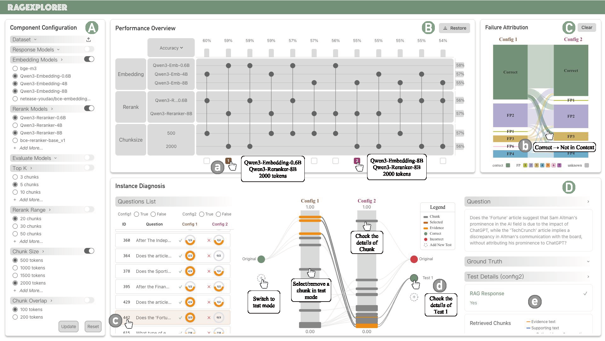

# RAG Explorer

An interactive RAG (Retrieval-Augmented Generation) system visualization platform for exploring and comparing different RAG configurations, models, and parameters.



**Figure**: An overview of our visual analytic system. Our system integrates four coordinated views:

- **Component Configuration View (A)** allows users to define an experimental space by selecting options for each RAG component.
- **Performance Overview View (B)** uses a matrix and coordinated bar charts to display the ranked performance of all configurations, allowing users to identify top performers and assess the average impact of each component choice.
- **Failure Attribution View (C)** uses a Sankey diagram to visualize the flow of questions between different failure attribution when comparing two RAG configurations, allowing users to see exactly how a design change impacts RAG's failure points.
- **Instance Diagnosis View (D)** uses a three-panel layout, allowing users to select questions from a list, use a central dual-track view to visually compare contexts and interactively test hypotheses, and inspect their full text in a details panel.

### Tech Stack

**Backend**: Python 3.10, Flask, LangChain, ChromaDB, Sentence Transformers
**Frontend**: Next.js 15, React 19, TypeScript, D3.js, Tailwind CSS

## Features

- **Multi-Configuration Comparison**: Compare up to 2 RAG configurations side-by-side
- **Interactive Visualizations**: Upset view, Sankey diagrams, and retrieval context tracking
- **Flexible Parameters**: Configure embedding models, LLMs, chunking strategies, and reranking...
- **Dataset Management**: Upload and manage custom question and corpus datasets
- **Concurrent Processing**: Parallel evaluation with customizable worker count
- **Smart Caching**: Persistent cache for faster re-evaluation
- **Comprehensive Metrics**: Accuracy, Recall, MRR, MAP

## Quick Start

### Prerequisites

- Python 3.10+
- Node.js 18+
- Conda (recommended)

### Installation

1. **Clone the repository**

```bash
git clone https://github.com/Thymezzz/RAGExplorer.git
cd RAGExplorer
```

2. **Setup Backend**

```bash
cd backEnd
conda env create -f environment.yml
conda activate ragExplorer
```

3. **Configure API Keys and Models**

Create a `.env` file in the `backEnd` directory:

```bash
cd backEnd
cp .env.example .env
```

Edit `.env` and add your API keys:

```env
# LLM API Configuration
LLM_API_KEY=your-llm-api-key
LLM_BASE_URL=https://your-llm-api-endpoint/v1

# Embedding API Configuration
EMBEDDING_API_BASE_URL=https://your-embedding-api-endpoint/v1
EMBEDDING_API_KEYS=key1,key2,key3  # Comma-separated for multiple keys
```

**Note**: You can add multiple embedding API keys (comma-separated) for higher rate limits.

**Customize Available Models** (optional):

Edit `backEnd/rag_utils/config.py` to update model lists:

```python
# Update available models based on your API support
embedding_api_models = [
    "BAAI/bge-m3",
    "Qwen/Qwen3-Embedding-0.6B",
    # Add models supported by your embedding API
]

rerank_api_models = [
    "BAAI/bge-reranker-v2-m3",
    "Qwen/Qwen3-Reranker-0.6B",
    # Add models supported by your reranking API
]
```

**For LLM Models**: The system automatically reads from `backEnd/models_data.json`. You can:

- Use the provided `extract_models.py` to fetch models from OpenRouter API
- Or manually create/update `models_data.json` with your custom LLM API's model list:
  ```json
  {
    "data": [
      {
        "id": "model-id",
        "name": "Model Display Name"
      },
      {
        "id": "another-model-id",
        "name": "Another Model Name"
      }
    ]
  }
  ```
  Note: Optional `pricing` field (with `prompt` and `completion` keys) can be added for automatic price-based sorting.

4. **Setup Frontend**

```bash
cd ../frontEnd
npm install
```

### Running

**Start Backend** (in terminal 1):

```bash
cd backEnd
conda activate ragExplorer
python3 server.py
```

Backend runs on `http://localhost:6006`

**Start Frontend** (in terminal 2):

```bash
cd frontEnd
npm run dev
```

Frontend runs on `http://localhost:3000`

### Usage

1. Open `http://localhost:3000` in your browser
2. Upload your datasets (questions and corpus) in the Configuration View
   - **Questions Dataset**: JSON array with `query`, `answer`, and `evidence_list` fields
   - **Corpus Dataset**: JSON array with `body` (required), and optional `title`, `url` fields
   - See example datasets in the `dataset/` folder for reference format
3. Configure RAG parameters (embedding model, LLM, chunking, reranking, etc.) in **Component Configuration**
   - Use the **Compare Mode** switch (top-right corner) for each parameter:
     - **Switch ON**: Enable multi-selection to compare different values
     - **Switch OFF**: Fix this parameter to a single value across all configurations
4. Run evaluation and view results in Dashboard
   - **Note**: First-time evaluation may take time. For faster results, consider using batch precomputation:
     ```bash
     cd backEnd
     python3 batch_precompute.py --workers 5
     ```
     This will precompute and cache results for common parameter combinations. See `batch_precompute.py` for configuration options.
5. Compare configurations in **Performance Overview**
   - Switch between different parameters to view performance differences
   - Toggle sorting to order configurations by metrics
   - Select two configurations for detailed comparison
6. Analyze failure patterns in **Failure Attribution**
   - After selecting two configurations in Performance Overview, compare their RAG failure stages
   - Click on specific failure categories to drill down into affected questions
7. Diagnose individual instances in **Instance Diagnosis**
   - View all questions affected by the selected failure pattern
   - Click on blocks to inspect retrieved context within RAG's retrieval range
   - Ground truth evidence is underlined in **orange**, while LLM-identified evidence is underlined in **blue**
   - Use **"Add New Test"** to experiment with alternative contexts and evaluate if different document combinations produce better results

## Project Structure

```
ragvis_new/
├── backEnd/
│   ├── rag_utils/               # Core RAG modules
│   │   ├── embeddings.py        # Embedding API interface
│   │   ├── reranker.py          # Reranking API interface
│   │   ├── vectorstore.py       # Chroma vector store
│   │   ├── config.py            # Configuration and API keys
│   │   ├── cache_manager.py     # Cache management
│   │   ├── parameter_generator.py # Parameter configuration
│   │   ├── workflow_factory.py  # Workflow creation
│   │   ├── response_formatter.py # Response formatting
│   │   ├── dataset_manager.py   # Dataset upload/management
│   │   ├── api.py               # LLM API client
│   │   ├── evaluator.py         # Response evaluation
│   │   ├── evidence_analyzer.py # Evidence analysis and metrics
│   │   ├── error_analysis.py    # Failure case analysis
│   │   ├── json_parser.py       # Robust JSON parsing
│   │   ├── response_parser.py   # Response parsing utilities
│   │   ├── rate_limiter.py      # API rate limiting
│   │   └── utils.py             # Utility functions
│   ├── rag.py                   # Basic RAG system
│   ├── workflow.py              # Batch evaluation and analyse workflow
│   ├── server.py                # Flask API server
│   ├── batch_precompute.py      # Batch precomputation script for caching results
│   ├── environment.yml          # Conda environment
│   ├── cache/                   # Cached results and vectorstore
│   └── uploaded_datasets/       # User uploaded datasets
│       ├── questions/           # Question datasets
│       └── corpus/              # Corpus datasets
│
└── frontEnd/
    ├── src/
    │   ├── components/          # React components
    │   │   ├── Dashboard.tsx    # Main dashboard
    │   │   ├── ComparisonView.tsx # Configuration comparison
    │   │   ├── ChessboardAnalysisPlot.tsx # Parameter grid
    │   │   ├── ConfigurationView.tsx # Parameter configuration
    │   │   ├── QueryView.tsx    # Single query interface
    │   │   ├── SankeyView.tsx   # Sankey diagram visualization
    │   │   ├── TextView.tsx     # Text display component
    │   │   ├── ParameterSelector.tsx # Parameter selection UI
    │   │   ├── NavBar.tsx       # Navigation bar
    │   │   └── ui/              # Reusable UI components
    │   │       ├── checkbox.tsx # Checkbox component
    │   │       └── switch.tsx   # Switch component
    │   ├── server/
    │   │   └── server.tsx       # API client
    │   ├── app/                 # Next.js app router
    │   │   ├── page.tsx         # Main page
    │   │   ├── layout.tsx       # Root layout
    │   │   ├── globals.css      # Global styles
    │   │   └── favicon.ico      # Favicon
    │   ├── lib/
    │   │   └── utils.ts         # Utility functions
    │   └── types/
    │       └── d3-sankey.d.ts   # D3 Sankey type definitions
    ├── package.json
    └── tsconfig.json
```

**Note**: This is a research tool for RAG system evaluation. API costs may apply based on usage.
